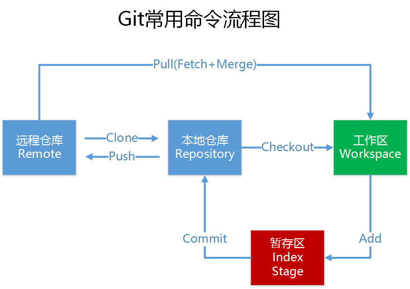

# 用户配置
1. 打开Git Bash
2. 设置用户信息
```
git config --global user.name "your name"
git config --global user.email "your email"
```
3. 查看配置信息
```
git config --global user.name
git config --global user.email
```

# 指令别名
1. 打开Git Bash，创建 .bashrc 文件 `touch ~/.bashrc`
2. 在 .bashrc 文件中输入如下内容：
```
#输出git提交日志
alias git-log='git log --pretty=oneline --all --graph --abbrev-commit'
#输出当前目录中所有文件及基本信息
alias ll ='ls -al'
```
3. 执行`source ~/.bashrc`
# 获取本地仓库
1. 选定一个目录
2. 在此目录中右键，打开Git Bash
3. 执行`git init`
4. 创建成功后，可在目录下看到隐藏的 .git 目录
# 基础操作指令

## status
- 作用：查看修改状态（暂存区/工作区）
- 格式：`git status`
## add
- 作用：添加一个或多个文件的修改到暂存区
- 格式：`git add 单个文件名|通配符 或将所有修改加入暂存区 git add .`
## commit
- 作用：提交暂存区所有内容到本地仓库的当前分支
- 格式：`git commit -m "注释"`
## log
- 作用：查看提交记录
- 格式：`git log [option]`
- option
    - all 显示所有分支
    - pretty=oneline 将提交信息显示为一行
    - abbrev-commit 使得输出的commitId更简短
    - graph 以图的形式显示
## 版本回退
## 添加文件至忽略列表
1. 创建 .gitignore 文件：`touch .gitignore`
2. 在 .gitignore 文件中添加要忽略的文件名
# 分支
## 查看本地分支
## 创建本地分支
## 切换本地分支
## 合并分支
## 删除分支
## 解决冲突
## 原则与流程

---
# Git远程仓库
## 创建远程仓库
SSH 远程仓库地址
## 配置SSH公钥
1. 生成SSH公钥：``ssh-keygen -t rsa`
2. 获取公钥：``cat ~/.ssh/id_rsa.pub
3. 将公钥与远程仓库账户关联
4. 验证是否配置成功：`ssh -T git@github.com`
	- ==若出现问题：==
		`The authenticity of host 'github.com (<no hostip for proxy command>)' can't be established.`
		- 解决办法：
		 `ssh-keyscan -t rsa github.com >> ~/.ssh/known_hosts
`
## 操作远程仓库
==此操作是先初始化本地仓库，然后于已创建的远程仓库进行对接==
- 命令：`git remote add <远端名称> <仓库路径SSH>
	- 远端名称：默认是origin，取决于远端服务器设置
	- 仓库路径：从远端服务器获取SSH
## 查看远程仓库
- 命令：`git remote [options]`
## 推送到远程仓库
- 命令：git push [-f] [–set-upstream] [远端名称 [本地分支名][:远端分支名] ]
## 本地分支与远程分支的关联关系
## 从远程仓库克隆
## 从远程仓库中抓取和拉取
## 解决合并冲突

---
---
# 快速使用
要将本地文件提交到远程仓库（如 GitHub），你可以按照以下步骤操作：

1. **确保本地仓库已初始化**：如果你的项目还没有一个 Git 仓库，请先进行初始化。

   ```bash
   git init
   ```

2. **添加文件到暂存区**：将要提交的文件添加到 Git 的暂存区。

   ```bash
   git add <file1> <file2> ...  # 添加指定文件
   git add .                    # 添加所有修改过的文件
   ```

3. **提交文件**：将暂存区的文件提交到本地仓库。

   ```bash
   git commit -m "提交说明"
   ```

   其中，`提交说明` 是你本次提交的简短描述，用于说明本次提交的目的或修改内容。

4. **关联远程仓库**：如果远程仓库还没有关联，需要添加远程仓库地址。

   ```bash
   git remote add origin <远程仓库地址>
   ```

   其中，`<远程仓库地址>` 是你 GitHub 仓库的 SSH 或 HTTPS 地址。

5. **推送到远程仓库**：将本地仓库的提交推送到远程仓库。

   ```bash
   git push -u origin main
   ```

   这条命令将本地的 `main` 分支推送到远程仓库（如果你的主分支不是 `main`，请替换成你的实际主分支名称）。